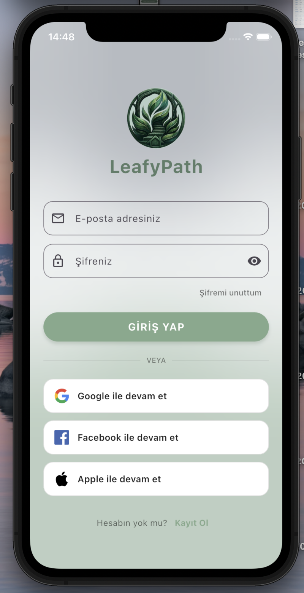
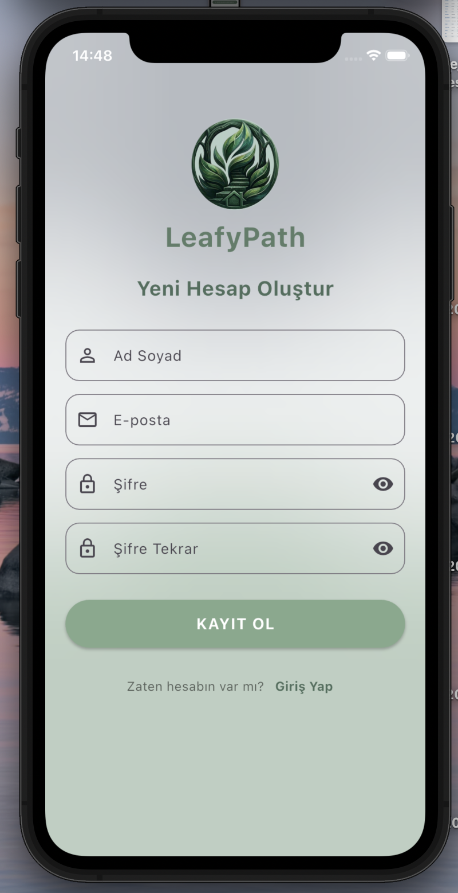
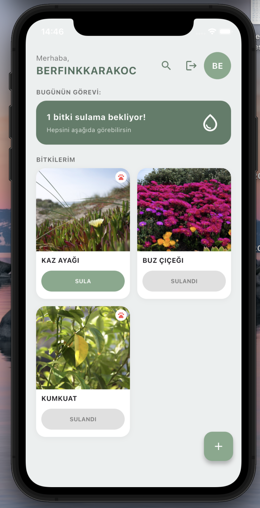
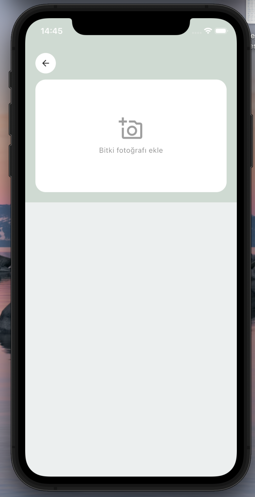
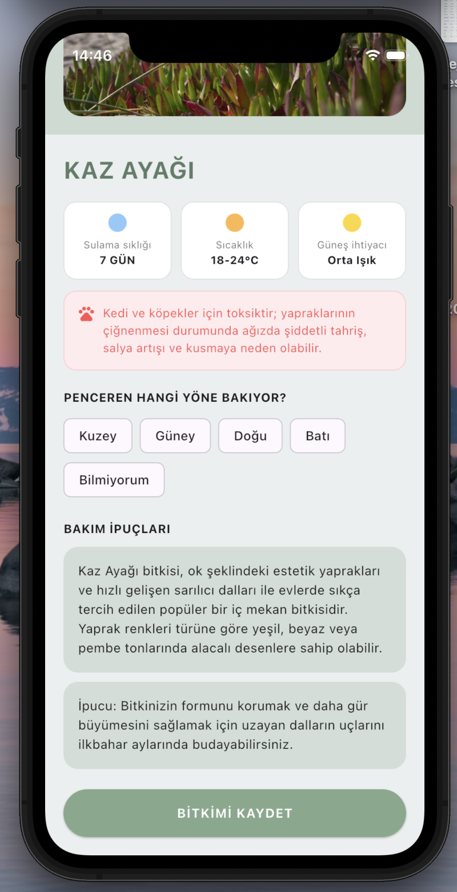
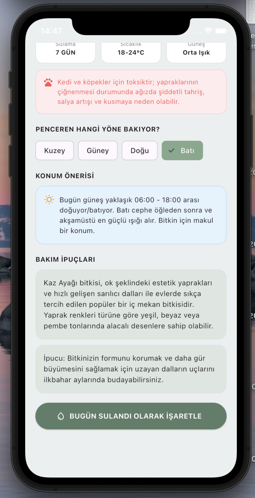
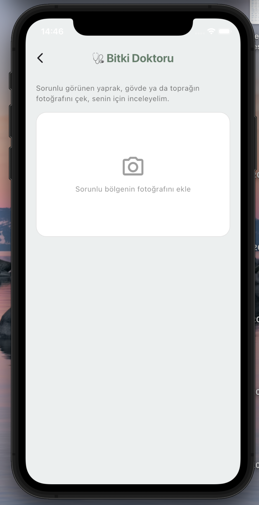
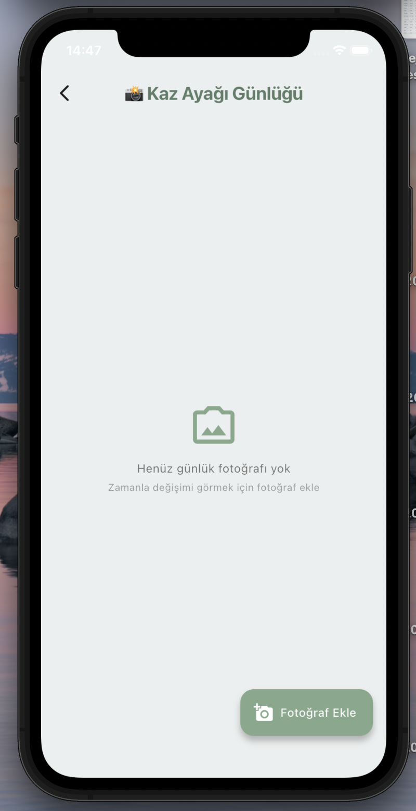
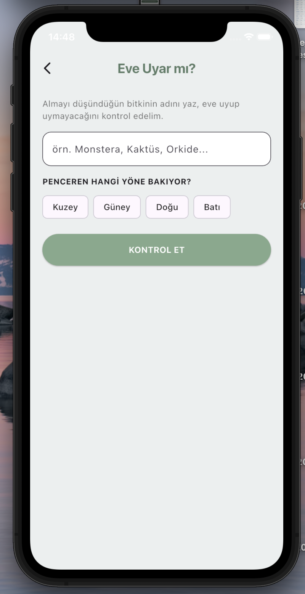

# 🌿 LeafyPath

Yapay zeka destekli bitki bakım uygulaması. Bitkinin fotoğrafını çek, türünü öğren, kişiselleştirilmiş bakım tavsiyesi al ve bitkilerini asla susuz bırakma.

## ✨ Özellikler

- 📸 **AI ile bitki tanıma** — Fotoğraf çek, PlantNet API ile tür otomatik tanınsın
- 🤖 **Kişiselleştirilmiş bakım tavsiyesi** — Google Gemini ile sulama sıklığı, sıcaklık ve ışık ihtiyacı bilgisi
- 💧 **Sulama takibi ve bildirimler** — Ne zaman sulaman gerektiğini unutma
- ☀️ **Konum bazlı güneş önerisi** — Pencerenin yönüne göre bitkinin en iyi nereye konacağını öğren
- 🩺 **Bitki Doktoru** — Sararmış yaprak, leke gibi sorunları fotoğraftan analiz et
- 📔 **Büyüme Günlüğü** — Zaman içindeki değişimi fotoğraflarla takip et
- 🐾 **Evcil hayvan güvenliği** — Bitkinin kedi/köpek için zehirli olup olmadığını öğren
- 🛒 **"Eve Uyar mı?"** — Almadan önce bitkinin evine uygun olup olmadığını kontrol et

## 📱 Ekran Görüntüleri

| Giriş | Kayıt Ol | Ana Sayfa |
|---|---|---|
|  |  |  |

| Bitki Ekle | Bitki Detay | Konum Önerisi |
|---|---|---|
|  |  |  |

| Bitki Doktoru | Büyüme Günlüğü | Eve Uyar mı? |
|---|---|---|
|  |  |  |

## 🛠️ Kullanılan Teknolojiler

- **Framework:** Flutter (Dart)
- **Backend:** Firebase (Authentication, Firestore)
- **Görsel barındırma:** ImgBB
- **Bitki tanıma:** PlantNet API
- **Yapay zeka:** Google Gemini API (bakım tavsiyesi + hastalık teşhisi)
- **Konum:** Geolocator
- **Bildirimler:** flutter_local_notifications

## 🚀 Kurulum

1. Depoyu klonla:
   ```bash
   git clone https://github.com/berfinkkarakoc/leafy-path.git
   cd leafy-path
   ```

2. Bağımlılıkları yükle:
   ```bash
   flutter pub get
   ```

3. Proje kök dizininde bir `.env` dosyası oluştur ve kendi API key'lerini ekle:
   ```
   GEMINI_API_KEY=senin_key_in
   PLANTNET_API_KEY=senin_key_in
   IMGBB_API_KEY=senin_key_in
   ```

4. Firebase'i kendi projene bağla:
   ```bash
   flutterfire configure
   ```

5. Uygulamayı çalıştır:
   ```bash
   flutter run
   ```

## 📄 Lisans

Bu proje kişisel/eğitim amaçlı geliştirilmiştir.

---

Yapay zeka destekli geliştirme süreciyle inşa edilmiştir. 🌱
